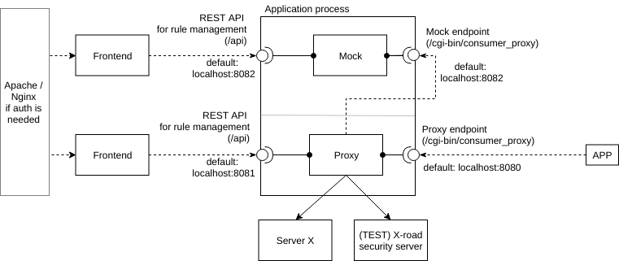

# X-road mock proxy server

This is a mock or proxy or both servers for X-road services. 

## Why?
Usual X-road setup is following. You application communicates directly with X-road security server over http/https or TLS client certificate authentication. 


This is all fine until you need to:

 * a) test complex test cases in your system and need to custom responses from X-road (i.e. mock responses)
 * b) use multiple X-road environments without modifying application code
 
**Use case**: I would like to use my default X-road server for all request except service X which I want to respond from my mock


**Use case**: I would like to use my Test X-road server for all request except service X,Y and Z which I want to respond from my DEV X-road server.


## Architecture



This repo compiles into single application that has 2 different parts.

* **proxy** - acts as a router. Accepts requests from APP and routes request based on configured rules to different servers. Contains REST API for to see proxied requests/responses and
add/modify/remove proxying rules.
* **mock** - responds configured SOAP messages to requests. Contains REST API to dynamically add/modify/remove rules/tempalates for responses.

## Features

* support X-road security server with ClientCert authentication
* support serving proxy on HTTP or HTTPS

## Configuration

See example [.xroad-mock-proxy-example.yaml](.xroad-mock-proxy-example.yaml)

Application is configured from configuration file (yaml) or env variables. By default configuration is read from `.xroad-mock-proxy.yaml` from 
current directory or read from file given with command line arg `--config=`. For example: `./xroad-mock-proxy --config=/opt/app/myconf.yaml`
Environment variables can be used to override `yaml` values during application startup. All ENV variables need to have `XMP_` prefix to work. 
For example mock address in yaml is configured as
```yaml
mock:
  address: localhost:8082
```
to override it with ENV variable do
```bash
export XMP_MOCK_ADDRESS=localhost:6000
./xroad-mock-proxy
```

## HOW TOs

1. [Systemd service setup](scripts/systemd/README.md)
2. [Handling certificates](docs/certificates.md)

# Development

## Requirements

1. [Go 1.12](https://golang.org/) - programming language
2. `make` or [Docker](https://www.docker.com/) - to build binaries

## Build binary

Assuming you have `go` and `make` installed.

Check/lint/test and build binary
```bash
make check
make
```

Run binary
```bash
cp .xroad-mock-proxy-example.yaml .xroad-mock-proxy.yaml
# edit `.xroad-mock-proxy.yaml`

# start server
./xroad-mock-proxy
```

## Build docker image
```bash
make docker
```

Run in Docker
```bash
make docker run-docker
```

